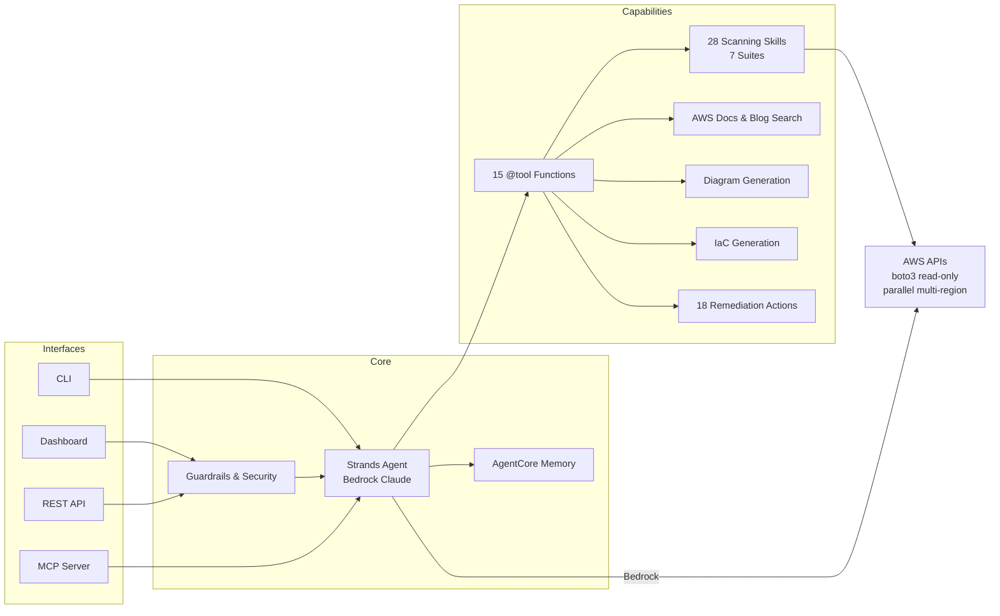

# ☁️✈️ CloudPilot — AWS Infrastructure Intelligence Platform

**The AI co-pilot that sees, understands, and optimizes your entire AWS estate.**

CloudPilot is an AI-powered conversational agent that combines the depth of a senior AWS Solutions Architect with real-time infrastructure scanning across 28 specialized skills. It discovers your resources, visualizes your architecture, finds security risks and cost waste, traces network paths, detects infrastructure drift, scores your DR readiness — and fixes what it finds with one-click remediation.

Chat with it in your browser. Point it at any AWS account. Get answers in seconds.

---

## The Problem

AWS environments grow fast. Teams accumulate hundreds of resources across dozens of regions — and lose visibility. The result:

- **Cost waste** — Zombie resources, oversized instances, unused reservations bleeding money every month
- **Security blind spots** — Open ports, public buckets, stale IAM keys, unencrypted databases hiding in plain sight
- **Resilience gaps** — Single-AZ databases, missing backups, no DR plan, untested recovery
- **Operational drift** — Infrastructure diverging from IaC definitions, compliance policies violated silently
- **Network complexity** — "Why can't service A reach service B?" takes hours of console clicking

Existing tools give you dashboards full of data. CloudPilot gives you a **conversation** — ask a question, get an answer, fix the problem.

## The Solution

```
    ASK  →  DISCOVER  →  ANALYZE  →  VISUALIZE  →  FIX
     ↑                                               |
     └────────────────────────────────────────────────┘
```

CloudPilot wraps 28 scanning skills, architecture discovery, IaC generation, and one-click remediation behind a natural language interface powered by Amazon Bedrock (Claude). It's a full AWS Solutions Architect that never sleeps, never forgets, and can inspect your live infrastructure in real time.

---

## 28 Scanning Skills Across 7 Suites

| Suite | Skills | What It Finds |
|-------|--------|---------------|
| 💰 **FinOps** | cost-radar, zombie-hunter, costopt-intelligence, database-optimizer | Spend anomalies, idle EC2/RDS, unattached EBS, unused EIPs/NATs, RI/SP gaps, oversized databases |
| 🛡️ **Security** | security-posture, data-security, secrets-hygiene, sg-chain-analyzer | Open ports, public S3, stale IAM keys, unencrypted data, Macie findings, secret rotation gaps, SG chains |
| 🌐 **Network** | network-path-tracer, connectivity-diagnoser, network-topology, dns-cert-manager | VPC path reachability, blocked routes, SG/NACL conflicts, topology diagrams, expiring certs, DNS issues |
| 🏗️ **Platform** | drift-detector, eks-optimizer, serverless-optimizer, arch-diagram, lifecycle-tracker | CFN/Terraform drift, EKS version gaps, Lambda cold starts, deprecated runtimes, EOL engines |
| 🔄 **Resilience** | resiliency-gaps, backup-dr-posture, blast-radius, health-monitor, capacity-planner | DR readiness score (0-100), unprotected resources, single-AZ databases, missing backups, blast radius |
| 🏢 **Governance** | tag-enforcer, quota-guardian, multi-account-governance, shadow-it-detector | Untagged resources, quota limits, SCP gaps, shadow IT resources outside governance |
| 🚀 **Modernization** | modernization-advisor, event-analysis | Graviton migration candidates, managed service replacements, CloudTrail risk events |

## Key Capabilities

### Conversational Intelligence
Ask anything about AWS — architecture design, service comparisons, best practices, or your live infrastructure:
- *"Why can't my Lambda reach my RDS?"*
- *"What's wasting money in us-east-1?"*
- *"Show me my architecture as a diagram"*
- *"Score my DR readiness"*
- *"Generate Terraform for my VPC setup"*

### Architecture Discovery & Visualization
Discovers EC2, RDS, Lambda, S3, ECS, VPC, DynamoDB, SQS, SNS, API Gateway, CloudFront, ELB across all regions. Generates interactive Mermaid diagrams with 5 view types: default, security, cost, multi-region, traffic-flow.

### Network Path Tracing with Visual Diagrams
Traces connectivity between any two resources (EC2, RDS, Lambda, ECS, ELB) through route tables, VPC peering, NAT gateways, and internet gateways. Generates a color-coded Mermaid flowchart showing each hop — green for allowed, red for blocked.

### Infrastructure Drift Detection
Detects drift across 4 dimensions: CloudFormation stack drift, Terraform state drift, configuration baseline drift, and compliance policy violations. Supports custom policies with 7 operators.

### DR Readiness Scoring
Weighted composite score (0-100) across 5 dimensions: backup coverage (30%), cross-region replication (25%), frequency (15%), retention (15%), and PITR (15%). Identifies the weakest dimensions and unprotected resources.

### IaC Generation
Produces CDK Python, CloudFormation YAML, or Terraform HCL from discovered resources — with inline comments, proper variable extraction, and scope filtering.

### One-Click Remediation
18 remediation actions with confirmation: delete orphaned volumes, release unused EIPs, restrict open security groups, enable Multi-AZ, enable backups, apply tags, upgrade deprecated runtimes, and more.

### Persistent Memory
Powered by Bedrock AgentCore — the agent remembers your infrastructure context, past scans, and remediation history across sessions.

---

## Deployment Options

CloudPilot is designed to meet customers where they are — from a developer's laptop to a fully managed cloud deployment.

### 1. Local Developer Workstation
The fastest path to value. Install, point at your AWS profile, start chatting.

```bash
git clone https://github.com/ramuponugumati/cloudpilot.git
cd cloudpilot
pip install -e .
cloudpilot --profile your-profile dashboard
```
Opens http://127.0.0.1:8080. Ideal for individual developers, SA demos, and proof-of-concept.

### 2. Docker Deployment
Containerized for team environments. Mounts AWS credentials read-only.

```bash
docker-compose up
```
Runs behind API key authentication, rate limiting, and security headers. Suitable for shared team servers or EC2 instances.

### 3. MCP Server Integration
Expose CloudPilot as a Model Context Protocol (MCP) tool server — plug it into Kiro, Claude Desktop, Amazon Q Developer, or any MCP-compatible client.

```bash
# stdio transport (local IDE integration)
cloudpilot mcp

# SSE transport (remote clients)
cloudpilot mcp --transport sse --port 8081
```

**MCP config for Kiro / Claude Desktop:**
```json
{
  "mcpServers": {
    "cloudpilot": {
      "command": "cloudpilot",
      "args": ["mcp", "--profile", "your-profile"]
    }
  }
}
```

This turns CloudPilot into a tool that any AI agent can call — scan infrastructure, trace network paths, generate IaC, all from within your IDE.

### 4. DevOps Agent Integration
CloudPilot's skills can be embedded into CI/CD pipelines and DevOps automation:

```python
from cloudpilot.core import SkillRegistry
from cloudpilot.aws_client import get_regions
import cloudpilot.skills  # auto-register all 28 skills

# Run security scan in CI pipeline
skill = SkillRegistry.get("security-posture")
result = skill.scan(regions=["us-east-1"], profile="ci-readonly")

# Fail the pipeline if critical findings exist
if result.critical_count > 0:
    print(f"BLOCKED: {result.critical_count} critical security findings")
    for f in result.findings:
        if f.severity.value == "critical":
            print(f"  - {f.title}: {f.description}")
    exit(1)
```

Use cases:
- **Pre-deploy gate** — Block deployments with critical security findings
- **Post-deploy validation** — Verify drift detection after CloudFormation/Terraform apply
- **Scheduled scans** — EventBridge-triggered Lambda running nightly cost/security sweeps
- **Slack/Teams bot** — Wrap the agent in a webhook handler for ChatOps

### 5. Bedrock AgentCore Runtime
Deploy as a managed agent on AWS with persistent memory, session management, and auto-scaling:

```bash
agentcore deploy --entry-point agent.py
```

This gives you a fully managed endpoint with built-in memory, guardrails, and observability — ideal for production multi-tenant deployments.

### 6. Standalone API Server
Run the FastAPI dashboard server as a standalone API for custom frontends or integrations:

```bash
CLOUDPILOT_API_KEY=your-key cloudpilot --profile prod-readonly dashboard --host 0.0.0.0 --port 8080
```

API endpoints: `/api/chat`, `/api/scan/{skill}`, `/api/discover`, `/api/diagram`, `/api/iac`, `/api/remediate`

---

## Customer Value Proposition

### For Platform Engineering Teams
- **Instant visibility** across multi-account, multi-region AWS estates
- **Automated compliance** — continuous drift detection and policy enforcement
- **Self-service infrastructure intelligence** — developers ask questions instead of filing tickets

### For FinOps Teams
- **Cost waste identification** — zombie resources, oversized instances, unused reservations
- **Spend anomaly detection** — week-over-week spikes, new service alerts
- **Optimization recommendations** — Graviton migration, Savings Plans, rightsizing

### For Security Teams
- **CSPM in a conversation** — 25+ security checks across IAM, S3, EC2, RDS, VPC
- **Data classification** — Macie integration, encryption audit, cross-account access detection
- **Secrets hygiene** — rotation enforcement, unused secret detection, SSM parameter audit

### For SRE / Operations Teams
- **DR readiness scoring** — weighted composite score with actionable improvement plan
- **Network troubleshooting** — "Why can't A reach B?" answered in seconds with visual path diagram
- **Blast radius analysis** — understand the impact before making changes

### For Solutions Architects
- **Live architecture diagrams** — generated from real resources, not hand-drawn
- **IaC reverse engineering** — CDK/CFN/Terraform from existing infrastructure
- **Well-Architected alignment** — findings mapped to the 6 pillars

---

## Architecture

Built on **Strands Agents SDK** with **Amazon Bedrock** (Claude) and **AgentCore** for memory.



---

## Quick Start

```bash
# Clone and install
git clone https://github.com/ramuponugumati/cloudpilot.git
cd cloudpilot
pip install -e .

# Launch dashboard
cloudpilot --profile your-profile dashboard

# Or use CLI chat
cloudpilot --profile your-profile chat

# Or start MCP server
cloudpilot mcp
```

## Prerequisites

- Python 3.10+ (tested on 3.13)
- AWS credentials configured (`aws configure` or named profile)
- Amazon Bedrock model access (Claude Sonnet) enabled in your account
- `pip install -e .` handles all Python dependencies

## CLI Reference

```bash
cloudpilot --profile my-profile dashboard     # Browser dashboard
cloudpilot --profile my-profile chat          # Terminal chat
cloudpilot --profile my-profile scan --all    # Run all 28 skills
cloudpilot --profile my-profile scan zombie-hunter  # Single skill
cloudpilot --profile my-profile discover      # Architecture discovery
cloudpilot --profile my-profile iac --format terraform --output infra/
cloudpilot mcp                                # MCP server (stdio)
cloudpilot mcp --transport sse --port 8081    # MCP server (SSE)
cloudpilot skills                             # List all skills
```

## Configuration

| Variable | Default | Description |
|----------|---------|-------------|
| `CLOUDPILOT_API_KEY` | _(none)_ | API key for non-localhost deployments |
| `CLOUDPILOT_CORS_ORIGINS` | `localhost` | Allowed CORS origins |
| `CLOUDPILOT_RATE_LIMIT` | `60` | Requests per minute per IP |
| `CLOUDPILOT_MODEL` | `us.anthropic.claude-sonnet-4-20250514-v1:0` | Bedrock model ID |
| `CLOUDPILOT_BEDROCK_REGION` | `us-east-1` | Bedrock region |
| `CLOUDPILOT_MEMORY_REGION` | `us-east-1` | AgentCore Memory region |
| `CLOUDPILOT_AGENT` | _(strands)_ | Set to `legacy` for raw Bedrock Converse |

## Security

- API key authentication (auto-generated for non-localhost)
- Rate limiting (60 req/min, 15 burst)
- Security headers (CSP, X-Frame-Options, HSTS)
- Prompt injection protection
- Topic boundary enforcement
- Output sanitization (redacts AWS credentials from responses)
- Audit logging to `cloudpilot_audit.log`
- All AWS API calls are **read-only** (describe/list/get) — remediation requires explicit confirmation

## AWS Permissions

| Use Case | Required Policy |
|----------|----------------|
| Scanning (all 28 skills) | `ReadOnlyAccess` managed policy |
| Remediation | Additional write: `ec2`, `rds`, `s3`, `iam`, `lambda` |
| Agent (Bedrock) | `bedrock:InvokeModel` |
| Memory (AgentCore) | `bedrock:*AgentMemory*` |
| Cost Radar | `ce:GetCostAndUsage` |

## Cost to Run CloudPilot

CloudPilot itself is open-source and free. The cost comes from the AWS services it uses. Here's a realistic breakdown for a typical single-account deployment.

### Per-Conversation Costs (Bedrock Claude)

| Usage Pattern | Input Tokens | Output Tokens | Est. Cost per Chat Turn |
|---------------|-------------|---------------|------------------------|
| Simple question (no scan) | ~1,500 | ~500 | ~$0.01 |
| Single skill scan | ~3,000 | ~2,000 | ~$0.02 |
| Suite scan (4-5 skills) | ~8,000 | ~4,000 | ~$0.05 |
| Architecture discovery + diagram | ~10,000 | ~5,000 | ~$0.06 |
| IaC generation | ~12,000 | ~8,000 | ~$0.08 |

*Based on Claude Sonnet pricing: $3/M input tokens, $15/M output tokens (us-east-1, April 2025).*

### Monthly Cost Estimates by Usage Tier

| Component | Light Use (5 chats/day) | Moderate (20 chats/day) | Heavy (50 chats/day) |
|-----------|------------------------|------------------------|---------------------|
| **Bedrock (Claude Sonnet)** | ~$3-5 | ~$12-20 | ~$30-50 |
| **AWS API calls** (read-only) | $0 (free tier) | $0-2 | $2-5 |
| **Cost Explorer API** | ~$0.01/request | ~$0.30 | ~$1.00 |
| **AgentCore Memory** | ~$0 (free tier) | ~$0-1 | ~$1-2 |
| **EC2/Fargate** (if hosted) | $0 (local) | ~$15-30 | ~$15-30 |
| **Total (local deployment)** | **~$3-5/mo** | **~$12-23/mo** | **~$33-58/mo** |
| **Total (hosted on EC2)** | **~$18-35/mo** | **~$27-53/mo** | **~$48-88/mo** |

### What's Free

- All 28 scanning skills use **read-only AWS API calls** — most fall within free tier (describe/list/get)
- Running locally on your laptop — no compute cost
- MCP server mode — no additional cost beyond Bedrock
- Dashboard UI — static files served locally

### What Costs Money

- **Amazon Bedrock** — the primary cost driver. Each chat turn invokes Claude Sonnet. Longer conversations with tool use cost more tokens.
- **Cost Explorer API** — $0.01 per `GetCostAndUsage` request (cost-radar skill)
- **Hosting** (optional) — EC2 t3.small (~$15/mo) or Fargate if you want a shared team server
- **AgentCore Memory** (optional) — minimal cost for session persistence

### Cost Optimization Tips

- Use `CLOUDPILOT_MODEL` env var to switch to Claude Haiku for cheaper, faster responses on routine scans
- Run suites instead of individual skills to batch API calls
- Use the CLI for one-off scans (no persistent server cost)
- Local deployment = Bedrock-only cost, no infrastructure overhead

### Comparison to Alternatives

| Solution | Monthly Cost | Coverage |
|----------|-------------|----------|
| **CloudPilot (local)** | **$5-50** | 28 skills, conversational, IaC gen, remediation |
| AWS Trusted Advisor (Business Support) | $100+ (support plan) | ~50 checks, no conversation |
| Third-party CSPM (Prisma, Wiz) | $5,000-50,000+ | Security-focused, no IaC gen |
| Manual SA review | $10,000+ (time cost) | One-time, no automation |

---

## Testing

```bash
pip install -e ".[dev]"
pytest tests/ -v    # 122 tests (unit + property-based with Hypothesis)
```

Property-based tests cover: network path tracing (18 properties), drift detection (14 properties), backup/DR posture, secrets hygiene, EKS optimization, and tool executor dispatch.

---

## Roadmap

- [x] **Phase 1** — Foundation: Agent, Discovery, Diagrams, IaC, Dashboard, MCP, 12 skills
- [x] **Phase 2** — Network Intelligence: Path tracing, connectivity diagnosis, SG chain analysis, topology diagrams
- [x] **Phase 3** — Drift Detection: CFN drift, Terraform state drift, config baselines, compliance policies
- [x] **Phase 4** — Resilience & Security: Backup/DR scoring, data classification, secrets hygiene, blast radius
- [x] **Phase 5** — Platform Optimization: EKS, serverless, database optimization, modernization advisor
- [x] **Phase 6** — Governance: Tag enforcement, quotas, multi-account governance, shadow IT detection
- [ ] **Phase 7** — Continuous Monitoring: EventBridge scheduled scans, automated reports, Slack/Teams integration
- [ ] **Phase 8** — Multi-tenant SaaS: Organization-wide scanning, role-based access, tenant isolation

## License

Apache 2.0
