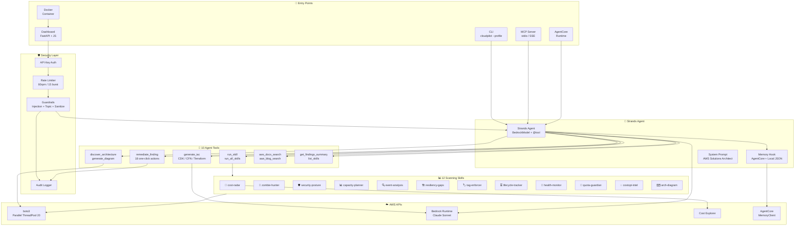
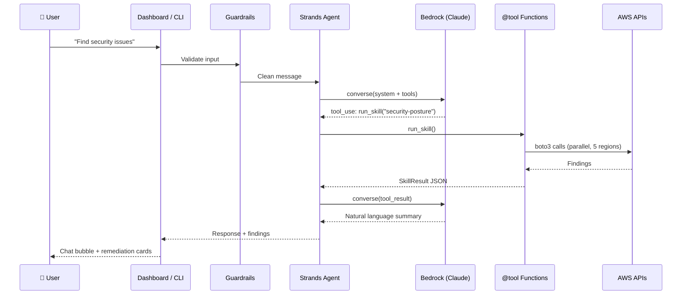

# ☁️✈️ CloudPilot — AWS Infrastructure Intelligence Platform

AI-powered conversational agent that discovers, visualizes, scans, and codifies your AWS infrastructure. Chat with it in your browser — it sees your real resources, generates architecture diagrams, finds security risks and cost waste, and produces Infrastructure as Code.

## What It Does

**The Infrastructure Intelligence Loop:**

```
DISCOVER → VISUALIZE → ANALYZE → TROUBLESHOOT → GENERATE (IaC)
    ↑                                                    |
    └────────────────────────────────────────────────────┘
```

- **Discover** — Scans all AWS resources across all regions, builds complete inventory
- **Visualize** — Generates interactive Mermaid architecture diagrams from live infrastructure
- **Analyze** — 12 scanning skills find security risks, cost waste, zombie resources, resiliency gaps
- **Generate IaC** — Produces CDK Python, CloudFormation YAML, or Terraform HCL from discovered resources
- **Fix** — 18 one-click remediation actions with confirmation
- **Remember** — Persistent memory across sessions via Bedrock AgentCore

## Quick Start

```bash
git clone https://github.com/ramuponugumati/cloudpilot.git
cd cloudpilot
pip install -e .
cloudpilot --profile your-profile dashboard
```

Opens http://127.0.0.1:8080 — start chatting with your infrastructure.

## Prerequisites

- Python 3.10+ (tested on 3.13)
- AWS credentials configured (`aws configure` or profile)
- Amazon Bedrock model access (Claude Sonnet) enabled in your account
- `pip install -e .` handles all Python dependencies

## Features

### Browser-Based Chat Agent
Natural language interface to your AWS infrastructure:
- *"Show me my production architecture"*
- *"What's wasting money in us-east-1?"*
- *"Generate Terraform for my VPC setup"*
- *"Find security issues"*
- *"What AWS service should I use for async message processing?"*

### 12 Scanning Skills
| Skill | Description |
|-------|-------------|
| 📡 cost-radar | 3-month spend overview, anomaly detection, WoW spikes, new service alerts, top-5 bar chart |
| 🧟 zombie-hunter | Idle EC2, unattached EBS, unused EIPs/NATs |
| 🛡️ security-posture | GuardDuty, Security Hub, open ports, public S3, old IAM keys |
| 📊 capacity-planner | ODCR utilization, SageMaker capacity, EC2 quotas |
| 🔍 event-analysis | CloudTrail high-risk events, Config compliance, root usage |
| 🏗️ resiliency-gaps | All 6 Well-Architected pillars |
| 🏷️ tag-enforcer | Find untagged EC2, RDS, S3, Lambda — auto-apply tags |
| ⏳ lifecycle-tracker | Deprecated Lambda runtimes, EOL RDS engines |
| 🏥 health-monitor | AWS Health events, Trusted Advisor checks |
| 📏 quota-guardian | Service quotas approaching limits |
| 💡 costopt-intelligence | Savings Plans, RI utilization, rightsizing, EBS optimization |
| 🗺️ arch-diagram | Resource discovery + architecture diagram generation |

### Architecture Mapping
- Discovers EC2, RDS, Lambda, S3, ECS, VPC, DynamoDB, SQS, SNS, API Gateway, CloudFront, ELB
- Detects anti-patterns (single-AZ RDS, public databases, open security groups, missing backups)
- Recommends managed service alternatives for self-managed EC2 workloads
- Generates Mermaid diagrams rendered inline in the browser

### IaC Generation

### Cost Overview Dashboard
The cost-radar skill automatically pulls 3 months of spend data from AWS Cost Explorer and generates:
- Total spend and average monthly cost (like Cost Explorer's overview)
- Top 5 services by spend with per-service monthly breakdown
- Mermaid bar chart rendered inline in the browser showing month-over-month trends
- Sum and average aggregates across the 3-month window

Try it: *"Run cost-radar scan"* or `cloudpilot scan cost-radar`

### IaC Generation
- **CDK Python** — AWS CDK v2 constructs
- **CloudFormation YAML** — Standard CFN templates
- **Terraform HCL** — With provider config and variables
- Scope filtering by service or resource ID
- Inline comments explaining each resource

### 18 One-Click Remediation Actions
Delete orphaned volumes, release unused EIPs, restrict open security groups, enable Multi-AZ, enable backups, apply tags, upgrade deprecated runtimes, and more.

### MCP Server
Expose CloudPilot as MCP tools for Kiro, Claude Desktop, or any MCP client:
```bash
cloudpilot mcp
```

### Persistent Memory
Powered by Bedrock AgentCore — the agent remembers your infrastructure context across sessions.

## CLI Usage

```bash
# Launch browser dashboard
cloudpilot --profile my-profile dashboard

# Interactive chat in terminal
cloudpilot --profile my-profile chat

# Run all scanning skills
cloudpilot --profile my-profile scan --all

# Run specific skill
cloudpilot --profile my-profile scan zombie-hunter

# Discover resources and generate diagram
cloudpilot --profile my-profile discover

# Generate IaC
cloudpilot --profile my-profile iac --format terraform --output infra/

# Start MCP server
cloudpilot mcp

# List skills
cloudpilot skills
```

## Configuration

| Variable | Default | Description |
|----------|---------|-------------|
| `CLOUDPILOT_API_KEY` | _(none)_ | API key for non-localhost deployments |
| `CLOUDPILOT_CORS_ORIGINS` | `localhost` | Allowed CORS origins |
| `CLOUDPILOT_RATE_LIMIT` | `60` | Requests per minute per IP |
| `CLOUDPILOT_MODEL` | `us.anthropic.claude-sonnet-4-20250514-v1:0` | Bedrock model ID |
| `CLOUDPILOT_BEDROCK_REGION` | `us-east-1` | Bedrock region |
| `CLOUDPILOT_MEMORY_REGION` | `us-east-1` | AgentCore Memory region |

## Security

- API key authentication (auto-generated for non-localhost)
- Rate limiting (60 req/min, 15 burst)
- Security headers (CSP, X-Frame-Options, etc.)
- Prompt injection protection
- Topic boundary enforcement
- Output sanitization (redacts AWS credentials)
- Audit logging

## AWS Permissions

**Scanning:** `ReadOnlyAccess` managed policy covers most skills.

**Remediation:** Additional write permissions for ec2, rds, s3, iam, lambda.

**Agent:** `bedrock:InvokeModel` for chat and IaC generation.

## Architecture

Built on **Strands Agents SDK** with **Bedrock AgentCore** for memory and runtime.



**Deployment options:**
- `pip install cloudpilot && cloudpilot --profile my-profile dashboard`
- `docker-compose up` (mounts ~/.aws read-only)
- `cloudpilot mcp --transport sse` (remote MCP clients)
- `agentcore deploy --entry-point agent.py` (AgentCore Runtime)

### Request Flow



## Roadmap

- **Phase 1** ✅ Foundation — Agent, Discovery, Diagrams, IaC, Dashboard, MCP
- **Phase 2** 🔜 Network Intelligence — Path tracing, connectivity diagnosis, SG chain analysis
- **Phase 3** 🔜 Drift Detection — IaC drift, config drift, baseline compliance
- **Phase 4** 🔜 Continuous Monitoring — EventBridge scheduled scans, automated reports

## License

Apache 2.0
